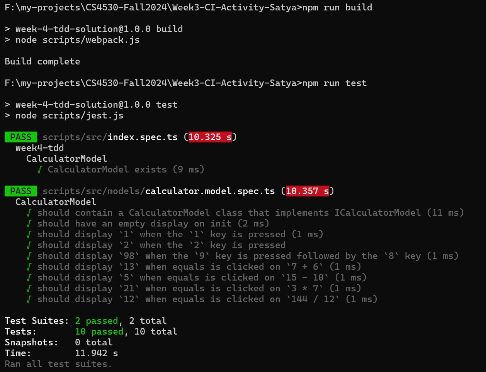

# Week3-CI-Activity: Instructions

This repository contains a basic implementation of a calcular, similar to the one you developed during the TDD class activity.
In today's class activity we'll create a basic CI workflow.

## Pre-requisites:

- Create a new repository with the same name in your own github account from the template repository:
  - https://github.com/neu-cs4530-fall2024/Week3-CI-Activity
- Invite your collaborators to this repository (give them at least Write access)
- Clone the repository
- `cd` into the repository
- Install and build the project, and confirm that the tests work:
```
npm install
npm run build
npm run test
```

The output should look something like this:


## Hello World Action:

- Create a directory `.github` with a sub-directory `workflows` within it.
   - The actions will be configured as YAML files inside `.github/workflows`.

- Create a file called `hello_world.yml` inside `.github/workflows`.
  - Open `.github/workflows/hello_world.yml`.
  
- Let us create a github action that does the following:
  - Runs when code is pushed to the main branch
  - Displays "Hello, World!"

- To achieve this, the `hello_world.yml` will have 3 parts to our YAML file:
  - `name:` The name for the github action 
  - `on:` The conditions when the action should execute
  - `jobs:` The tasks to perform as part of this github action

- The following changes are made to `.github/workflows/hello_world.yml`

### Adding a name

- Let us start by adding a name to our action
  - Being the creative person I am, I'll call it "Hello World"

- Add the following to `.github/workflows/hello_world.yml`
  - ```
    name: Hello World
    ```

### Adding the triggers

- Now, we want to things to run when 2 conditions are met:
  - The action is "push"
  - The branch is "main"

- We can do this as follows:
  - ```
    on:
      push:
        branches:
          - main
    ```

- Make sure the indentation is correct

### Adding the action

- Now, we want to display "Hello, World!" as part of the action

- We can add this as part of a job as below:
  - ```
    jobs:
      hello:

        runs-on: ubuntu-latest

        steps:
          - name: Display hello world
            run: echo "Hello, World"
    ```

### Completed File

`.github/workflows/hello_world.yml` should now look as below:

```

name: Hello World

on:
  push:
    branches:
      - main

jobs:
  hello:

    runs-on: ubuntu-latest

    steps:
      - name: Display hello world
        run: echo "Hello, World"

```

### Push the changes to github

```
git add .github/workflows/hello_world.yml
git commit -m "Adds 'hello world' workflow"
git push origin main
```

### Verify the output

- Navigate to your repository in the browser
- Click on "Actions" at the top
  - 
- Click on the latest work flow run
  - 
- Click on the job "hello"
  - 
- See the bash command executed for `echo "Hello, World!"`
  - 

## Your Task

- Your task is to create a file `.github/workflows/ci.yml` that will contain your workflow. 

- This workflow must satisfy the following requirements:
  - Runs on every push to the main branch
  - Runs on every pull request to the main branch
  - Runs when manually started by the user
  - Installs required OS package dependencies and npm dependencies
  - Runs all tests

*Note:* Please do not copy the sample YAML from the slides. It is for demonstration purposes and may not work for you! 
You will have to write this on your own.

- Once you have written your .yml file, `git add` it, `git commit` it, and `git push` it. Your Actions should kick off automatically.

*Hint:* you may find it helpful to do this in stages. 
Try adding code that runs npm install, then add code that builds the code, then adding code that runs the tests.

## Next Steps
Your final task is to experiment with some of the advanced features that are available with GitHub Actions. 
Please consult the documentation at `https://docs.github.com/en/actions` and try out a few of them. 
Examples of things you can try are:
- triggering an action when a new issue is created
- creating a ZIP file artifact containing the output of running the tests so that it can be downloaded from the GitHub actions page
- scheduling a periodic run of your tests (if you try this, please be sure to remove it after submitting your class activity to avoid wasting compute resources)

## SUBMISSION
Submit your CI file (.github/workflows/ci.yml) and a screenshot of your passing GitHub actions run via GradeScope. 
Please include all group member GradeScope submission.
